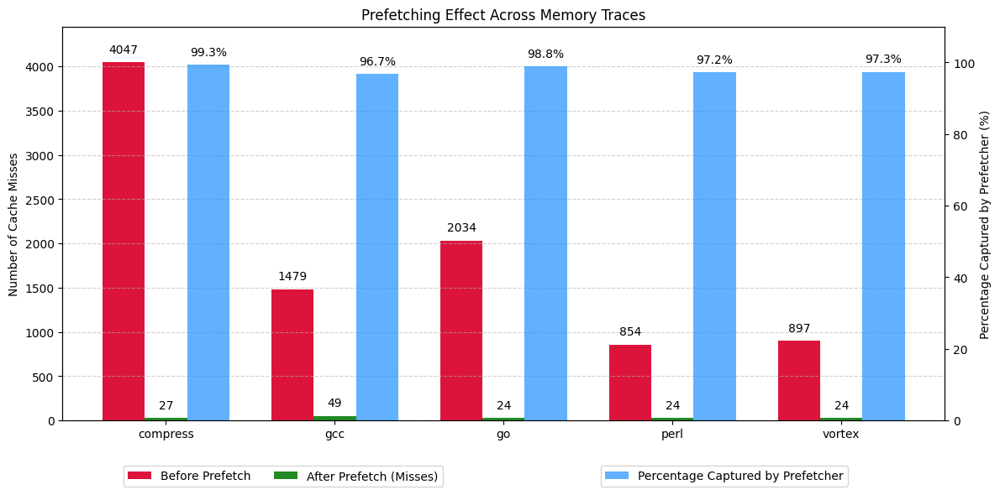

# CDA 5106 Spring 2025 Cache Simulator

**Generative AI Notice:** This ReadMe was generated using generative AI, though was checked by the authors for accuracy.

This project implements a cache simulator for CDA 5106 (Spring 2025), featuring both traditional cache simulation logic and an original **Graph-Based Markov Prefetcher**.

## Overview

The cache simulator models a two-level cache hierarchy and supports multiple replacement policies and inclusion properties. Additionally, it introduces a novel **Graph-Based Markov Prefetcher**, which attempts to predict and prefetch memory accesses based on patterns observed in the access trace.

## Features

* L1 and optional L2 cache simulation
* Support for LRU, FIFO, and Optimal replacement policies
* Inclusive and non-inclusive cache behavior
* Fully configurable via command-line arguments
* Optional Graph-Based Markov Prefetching mechanism
* Trace file-driven simulation

## Compiling

To build the simulator, ensure you're in the root directory and run:

```bash
make
```

This will generate an executable named `sim_cache` in the root directory.

## Running the Simulator

After compilation, run the simulator with the following syntax:

```bash
./sim_cache BLOCKSIZE L1_SIZE L1_ASSOC L2_SIZE L2_ASSOC REPLACEMENT_POLICY INCLUSION_PROPERTY trace_file [GRAPHQUEUESIZE]
```

### Required Arguments

* `BLOCKSIZE`: Block size in bytes (positive integer)
* `L1_SIZE`: L1 cache size in bytes (positive integer)
* `L1_ASSOC`: L1 set-associativity (positive integer; 1 = direct-mapped)
* `L2_SIZE`: L2 cache size in bytes (positive integer; 0 = no L2 cache)
* `L2_ASSOC`: L2 set-associativity (positive integer; 1 = direct-mapped)
* `REPLACEMENT_POLICY`:

  * 0 = LRU (Least Recently Used)
  * 1 = FIFO (First In, First Out)
  * 2 = Optimal
* `INCLUSION_PROPERTY`:

  * 0 = Non-Inclusive
  * 1 = Inclusive
* `trace_file`: Full path to the trace file (string)

### Optional Argument

* `GRAPHQUEUESIZE` (default: 0):
  Enables the Graph-Based Markov Prefetcher if set to a positive integer.
  This value defines the number of nodes allowed in the graph queue used by the prefetcher.

## Graph-Based Markov Prefetcher

This simulator includes a novel Graph-Based Markov Prefetcher that learns from previously seen memory access patterns and attempts to predict future accesses. When the optional `GRAPHQUEUESIZE` parameter is provided and greater than 0, the prefetcher is activated. This can lead to improved cache performance for workloads with recurring access patterns.

## Example Usage

```bash
./sim_cache 32 8192 4 32768 8 0 1 traces/gcc_trace.txt 50
```

This runs the simulator with:

* 32-byte block size
* 8KB 4-way L1 cache
* 32KB 8-way L2 cache
* LRU replacement
* Inclusive policy
* Using the `gcc_trace.txt` trace
* Graph-Based Prefetcher enabled with a queue size of 50

## Prefetcher Performance



---

## Contribution Attribution

This project was developed collaboratively by:

* **Michael Laager** – Lead developer for the cache simulator core, including L1/L2 hierarchy, replacement policy logic, configuration parsing, and output formatting.
* **[Jonathan Joslin](https://github.com/jjoslin0994)** –  Designer and developer of the **Graph-Based Markov Prefetcher**, including its graph construction, traversal, and prediction logic. Also responsible for the analysis of prefetching impact and memory access pattern modeling.

The novel graph-based approach to pattern recognition and prediction  eliminated **40–98% of cache misses** depending on the trace characteristics.
